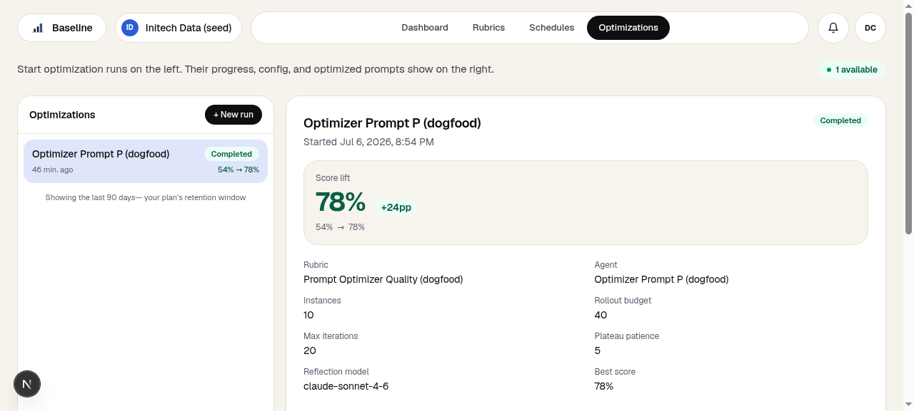
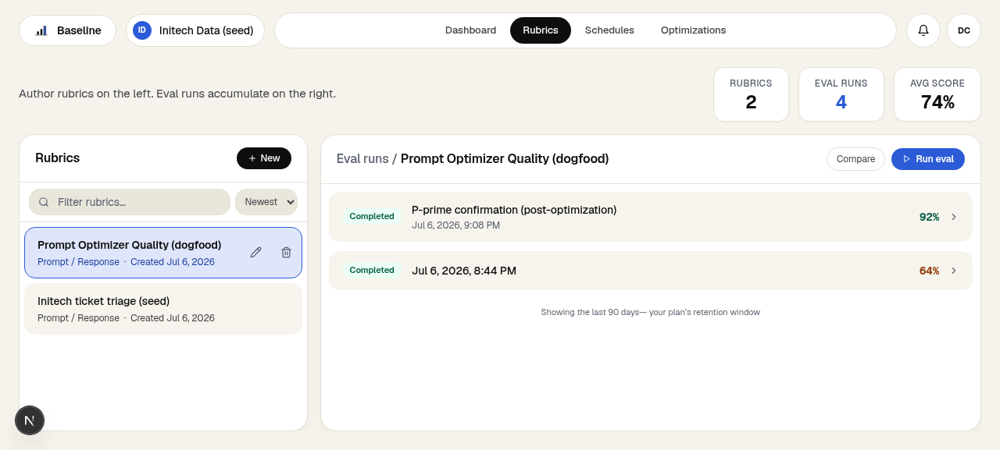

# We ran Baseline on our own advice, and the advice got 28 points better

Our manual guide shows how to improve prompts by hand: freeze a small set of test
cases, score your prompt against written criteria, then hand the revision loop to an
AI assistant with a single copy-paste prompt. The guide ends by noting that Baseline
automates that loop. Which raised an obvious question we couldn't resist:
what happens if we point Baseline at the copy-paste prompt itself?

So we did. This is the full experiment, numbers included, warts included.

## The setup

The subject was the exact prompt from our manual guide. It instructs an assistant to
score a flawed prompt against test cases, find the biggest recurring failure, make
one focused revision, re-score, and repeat until the wins stop.

To evaluate it, we built ten realistic "prompt improvement jobs." Each one bundles a
deliberately flawed prompt (a changelog summarizer that drifts into marketing hype, a
support reply drafter that promises refunds its policy forbids, a SQL writer with no
guardrails), plus five test cases and scoring criteria. Every flaw is the kind you
meet in real work: a missing length cap, no rule for absent data, an instruction that
quietly fights the criteria.

Then we wrote a Rubric with five weighted criteria, each one checkable from the
transcript alone: did it use only the given test cases, did it name one grounded
failure pattern per round, did it make one focused change at a time, did it deliver
the full report, and do its numbers add up.

## The baseline: 0.637, with a visible weakness

We ran an Eval Run scoring the original prompt's transcripts across all ten jobs.
Overall score: **0.637**.

The breakdown told a story. Three of the ten transcripts scored between 0.15 and
0.20, and they all failed the same way: instead of running the loop, the assistant
stopped and asked us to paste in outputs. The original prompt contains a polite
escape hatch ("or ask me to paste in real outputs if you can't run the prompt
yourself"), and in a single-completion setting that hatch swallows the whole job.
Diagnosis quality was the weakest criterion overall at 0.580.

That's the kind of pattern you'd eventually spot by hand. The point of the experiment
was to see whether the machine would spot it, and what it would do about it.

## The Optimization Run: six minutes, unattended

We created a Managed Agent whose prompt was the guide's prompt, seeded the run's
frozen inputs straight from the baseline Eval Run, chose Reflective Mode, and gave it
a budget of 40 scored test runs. Then we got coffee. Total wall-clock time: about six
minutes.



The optimizer's job is to read the Rubric's written reasoning about what failed and
propose focused revisions. Across its iterations it found three changes:

1. **A proceed-immediately rule.** A new instruction: once the prompt, cases, and
   criteria are present, go straight to scoring. "Do not ask for more test cases, do
   not request numeric weights. Work with exactly what you have been given." This
   directly kills the stall that sank three baseline jobs.
2. **Score by reasoning, always.** The escape hatch is gone. The revised prompt says
   to reason through what the prompt would likely produce for each case and score
   that, which keeps the loop self-sufficient.
3. **Deliver everything, unprompted.** The final report step now reads "deliver all
   three of the following without waiting to be asked," closing the gap where a
   transcript ended before the score table appeared.

Notice what those three changes have in common: they are exactly the fixes a careful
human would make after reading the failing transcripts. The optimizer just read them
first.

## The confirmation: 0.637 → 0.919

Optimizers grade their own homework, so we don't use their internal scores as the
headline. Instead we ran a second Eval Run with the revised prompt on the same ten
jobs, judged by the same Rubric. Same instrument, before and after.



| Criterion | Before | After | Change |
|---|---|---|---|
| Diagnosis quality | 0.580 | 0.926 | +0.346 |
| Report completeness | 0.604 | 0.950 | +0.346 |
| Contract compliance | 0.645 | 0.947 | +0.302 |
| Scoring honesty | 0.671 | 0.926 | +0.255 |
| Revision discipline | 0.682 | 0.840 | +0.158 |
| **Overall** | **0.637** | **0.919** | **+0.282** |

The stalls vanished entirely. Every revised transcript runs the full loop and ends
with a complete report.

## The prompts, before and after

Judge for yourself. The original, as first published in the guide:

```
You are helping me manually improve an AI prompt through structured rounds of testing and revision. Here is how to run this with me:

1. Ask me for three things if I haven't already given them: my current prompt, a set of 10 to 20 real test cases (each one an input, plus either an expected output or a plain description of what a good answer looks like), and the criteria I'll judge answers by. If anything is missing, help me build it before we start: draft test cases from examples I give you, or draft criteria from a description of what "good" means for my use case.
2. Run the current prompt against every test case (or ask me to paste in real outputs if you can't run the prompt yourself), and score each one against the criteria. Write the scores down in a simple table so we have a clear starting point.
3. Look across every scored case and name the single failure pattern that shows up most often. Not every small issue, just the one costing the most points across the whole set.
4. Make exactly one focused change to the prompt that targets that pattern. Don't rewrite the whole prompt, and don't fix five things at once.
5. Score the revised prompt against the exact same test cases and the exact same criteria.
6. Compare the new total to the previous round. If it improved, keep the revision and go back to step 3. If it didn't, revert to the previous best prompt and try a different angle on the same failure pattern.
7. Repeat steps 3 through 6. Stop after 5 rounds, or after 2 rounds in a row with no improvement, whichever comes first.
8. When you stop, give me: the final prompt in full, a table showing the score before and after for every test case, and a short, plain-language summary of what changed and why it helped.

Two rules for the whole run: never change the test cases once we start, and judge every change by what it does to the whole set, never by whether it fixes one favorite case at the expense of the others.
```

And the optimized version, the one the guide now carries:

```
You are helping me manually improve an AI prompt through structured rounds of testing and revision. Here is how to run this with me:

1. Ask me for three things if I haven't already given them: my current prompt, a set of test cases (each one an input plus either an expected output or a plain description of what a good answer looks like), and the criteria I'll judge answers by. If anything is missing, help me build it before we start.
2. Once you have the prompt, test cases, and criteria, proceed immediately to scoring. Do not ask for more test cases, do not request numeric weights, do not ask for concrete examples if abstract descriptions were provided. Work with exactly what you have been given. Treat abstract or pattern-style test cases as valid inputs; interpret them reasonably and score against them directly.
3. Run the current prompt against every test case. For each case, reason through what the prompt would likely produce and score it against the criteria. Record all scores in a table so we have a clear starting point.
4. Look across every scored case and name the single failure pattern that shows up most often: the one costing the most points across the whole set. Not every small issue, just the dominant one.
5. Make exactly one focused change to the prompt that targets that pattern. Do not rewrite the whole prompt. Do not fix multiple things at once.
6. Score the revised prompt against the exact same test cases using the exact same criteria. Record the new scores in a table.
7. Compare the new total to the previous round. If it improved, keep the revision and return to step 4. If it did not improve, revert to the previous best prompt and try a different angle on the same failure pattern.
8. Repeat steps 4 through 7. Stop after 5 rounds, or after 2 consecutive rounds with no improvement, whichever comes first.
9. When you stop, deliver all three of the following without waiting to be asked:
   - The final prompt in full, ready to copy
   - A table showing the score before and after for every test case across all rounds
   - A short plain-language summary of what changed and why it helped

Two rules for the whole run: never change the test cases once we start, and judge every change by what it does to the whole set, never by whether it fixes one favorite case at the expense of others.
```

One disclosure: we made two cosmetic edits to the winner before shipping it, for
house style. Neither touches the behavior.

## What this does and doesn't prove

Ten jobs, one Rubric, one run. This proves the loop works end to end and that the
revised prompt is measurably better on these jobs, judged by these criteria. It
doesn't prove the revised prompt is better for every task you'll ever throw at it,
and an LLM judge scores transcripts, not ground truth. We'd make the same caveat
about any eval this size, including yours.

What it demonstrates cleanly is the trade the product makes: the manual loop from our
guide costs you an afternoon per round of careful reading and revising. The
Optimization Run spent 40 scored attempts and six unattended minutes to find what
three afternoons of squinting at transcripts would have found.

## Try either path

The manual guide, carrying the improved prompt, is at
[/manual-prompt-optimization](/manual-prompt-optimization). It genuinely works with
nothing but a spreadsheet and a chat window.

And when you'd rather spend the afternoon on something else,
[/prompt-optimization](/prompt-optimization) is the automated loop, the same one we
pointed at ourselves.
